<div align="center">

# 👨‍🎓 Student Service

### RESTful Microservice for Student Management

[](https://spring.io/projects/spring-boot)
[](https://spring.io/projects/spring-cloud)
[](https://openjdk.org/)
[](https://www.mysql.com/)
[](LICENSE)

[Features](#-features) • [Architecture](#%EF%B8%8F-architecture) • [Quick Start](#-quick-start) • [API Documentation](#-api-documentation) • [Database](#-database-schema)

</div>

---

## 📖 Overview

The **Student Service** is a core microservice responsible for managing all student-related operations in the Student Management System. Built with **Spring Boot** and **Spring Cloud**, it provides comprehensive CRUD operations, student profile management, and seamless integration with the Course Service for enrollment tracking.

### Key Responsibilities

- 📋 **Student Management** - Create, read, update, and delete student records
- 👤 **Profile Management** - Manage student personal and academic information
- 🔍 **Student Search** - Search and filter students by various criteria
- 📊 **Academic Records** - Track student enrollments and academic progress
- 🔗 **Service Integration** - Communicate with Course Service for enrollment management

---

## ✨ Features

<table>
<tr>
<td>

- ✅ **RESTful API Design**
- ✅ **Service Discovery (Eureka)**
- ✅ **Centralized Configuration**
- ✅ **Database Integration (MySQL)**

</td>
<td>

- ✅ **Input Validation**
- ✅ **Exception Handling**
- ✅ **API Documentation (Swagger)**
- ✅ **Health Monitoring**

</td>
</tr>
</table>

---

## 🏗️ Architecture

```mermaid
graph TB
    A[👥 Client] -->|HTTP Request| B[🌐 API Gateway :8080]
    B -->|Route: /students/**| C[👨‍🎓 Student Service :8082]
    C -->|Register| D[🧭 Eureka Server :8761]
    C -->|Fetch Config| E[🧩 Config Server :8888]
    C -->|Query/Update| F[(MySQL Database)]
    C -->|REST Call| G[📚 Course Service]
    
    style C fill:#FF9800,stroke:#F57C00,stroke-width:3px,color:#fff
    style F fill:#4CAF50,stroke:#2E7D32,stroke-width:2px,color:#fff
```



### Microservices Ecosystem

| Service | Port | Description |
|---------|------|-------------|
| **Student Service** | `8082` | Student management microservice |
| **API Gateway** | `8080` | Routes requests to Student Service |
| **Eureka Server** | `8761` | Service registry and discovery |
| **Config Server** | `8888` | Centralized configuration |
| **Course Service** | `8083` | Course management (for enrollment) |

---

## 🚀 Quick Start

### Prerequisites

```bash
☑ Java 17 or higher
☑ Maven 3.8+
☑ MySQL 8.x
☑ Running Eureka Server (localhost:8761)
☑ Running Config Server (localhost:8888)
```

### Database Setup

```sql
-- Create database
CREATE DATABASE student_db;

-- Use database
USE student_db;

-- Create students table
CREATE TABLE students (
    id BIGINT AUTO_INCREMENT PRIMARY KEY,
    student_id VARCHAR(20) UNIQUE NOT NULL,
    first_name VARCHAR(50) NOT NULL,
    last_name VARCHAR(50) NOT NULL,
    email VARCHAR(100) UNIQUE NOT NULL,
    phone_number VARCHAR(20),
    date_of_birth DATE,
    gender VARCHAR(10),
    address TEXT,
    city VARCHAR(50),
    state VARCHAR(50),
    zip_code VARCHAR(10),
    country VARCHAR(50),
    enrollment_date DATE NOT NULL,
    graduation_date DATE,
    major VARCHAR(100),
    gpa DECIMAL(3, 2),
    status VARCHAR(20) DEFAULT 'ACTIVE',
    is_active BOOLEAN DEFAULT TRUE,
    created_at TIMESTAMP DEFAULT CURRENT_TIMESTAMP,
    updated_at TIMESTAMP DEFAULT CURRENT_TIMESTAMP ON UPDATE CURRENT_TIMESTAMP
);

-- Create student_courses table (for enrollment tracking)
CREATE TABLE student_courses (
    id BIGINT AUTO_INCREMENT PRIMARY KEY,
    student_id BIGINT NOT NULL,
    course_id BIGINT NOT NULL,
    enrollment_date DATE NOT NULL,
    grade VARCHAR(5),
    status VARCHAR(20) DEFAULT 'ENROLLED',
    FOREIGN KEY (student_id) REFERENCES students(id) ON DELETE CASCADE,
    UNIQUE KEY unique_enrollment (student_id, course_id)
);

-- Create indexes
CREATE INDEX idx_student_id ON students(student_id);
CREATE INDEX idx_email ON students(email);
CREATE INDEX idx_major ON students(major);
CREATE INDEX idx_status ON students(status);
CREATE INDEX idx_enrollment_date ON students(enrollment_date);
```

### Installation

```bash
# Clone the repository
git clone https://github.com/waseem-sk-dev/student-service.git
cd student-service

# Build the project
mvn clean install

# Run the application
mvn spring-boot:run
```

### Docker Deployment

```bash
# Build Docker image
docker build -t student-service:latest .

# Run container
docker run -p 8082:8082 \
  -e SPRING_DATASOURCE_URL=jdbc:mysql://host.docker.internal:3306/student_db \
  -e SPRING_DATASOURCE_USERNAME=root \
  -e SPRING_DATASOURCE_PASSWORD=password \
  student-service:latest
```

---

## ⚙️ Configuration

### application.yml

```yaml
# ============================
# Server Configuration
# ============================
server:
  port: 8082

# ============================
# Spring Application
# ============================
spring:
  application:
    name: student-service

  # ============================
  # Database Configuration
  # ============================
  datasource:
    url: jdbc:mysql://localhost:3306/student_db
    username: root
    password: ${DB_PASSWORD:password}
    driver-class-name: com.mysql.cj.jdbc.Driver
    
  jpa:
    hibernate:
      ddl-auto: update
    show-sql: true
    properties:
      hibernate:
        dialect: org.hibernate.dialect.MySQL8Dialect
        format_sql: true

  # ============================
  # Config Server
  # ============================
  config:
    import: optional:configserver:http://localhost:8888

# ============================
# Eureka Client
# ============================
eureka:
  client:
    service-url:
      defaultZone: http://localhost:8761/eureka/
    register-with-eureka: true
    fetch-registry: true
  instance:
    prefer-ip-address: true
    instance-id: ${spring.application.name}:${server.port}

# ============================
# Actuator Endpoints
# ============================
management:
  endpoints:
    web:
      exposure:
        include: health,info,metrics,prometheus
  endpoint:
    health:
      show-details: always

# ============================
# Logging
# ============================
logging:
  level:
    com.student.service: DEBUG
    org.springframework.web: INFO
    org.hibernate.SQL: DEBUG
```

### Environment Variables

```bash
# Database
export DB_HOST=localhost
export DB_PORT=3306
export DB_NAME=student_db
export DB_USERNAME=root
export DB_PASSWORD=your_password

# Service Configuration
export SERVER_PORT=8082
export EUREKA_URI=http://localhost:8761/eureka/
export CONFIG_SERVER_URI=http://localhost:8888
```

---

## 📊 Database Schema

### Student Entity

```sql
+------------------+---------------+------+-----+-------------------+
| Field            | Type          | Null | Key | Default           |
+------------------+---------------+------+-----+-------------------+
| id               | bigint        | NO   | PRI | AUTO_INCREMENT    |
| student_id       | varchar(20)   | NO   | UNI |                   |
| first_name       | varchar(50)   | NO   |     |                   |
| last_name        | varchar(50)   | NO   |     |                   |
| email            | varchar(100)  | NO   | UNI |                   |
| phone_number     | varchar(20)   | YES  |     |                   |
| date_of_birth    | date          | YES  |     |                   |
| gender           | varchar(10)   | YES  |     |                   |
| address          | text          | YES  |     |                   |
| city             | varchar(50)   | YES  |     |                   |
| state            | varchar(50)   | YES  |     |                   |
| zip_code         | varchar(10)   | YES  |     |                   |
| country          | varchar(50)   | YES  |     |                   |
| enrollment_date  | date          | NO   | MUL |                   |
| graduation_date  | date          | YES  |     |                   |
| major            | varchar(100)  | YES  | MUL |                   |
| gpa              | decimal(3,2)  | YES  |     |                   |
| status           | varchar(20)   | YES  | MUL | ACTIVE            |
| is_active        | boolean       | YES  |     | TRUE              |
| created_at       | timestamp     | YES  |     | CURRENT_TIMESTAMP |
| updated_at       | timestamp     | YES  |     | CURRENT_TIMESTAMP |
+------------------+---------------+------+-----+-------------------+
```

### Sample Data

```sql
INSERT INTO students (student_id, first_name, last_name, email, phone_number, date_of_birth, gender, address, city, state, zip_code, country, enrollment_date, major, gpa, status)
VALUES 
('STU001', 'John', 'Doe', 'john.doe@university.edu', '+1-555-0101', '2003-05-15', 'Male', '123 Main St', 'New York', 'NY', '10001', 'USA', '2021-09-01', 'Computer Science', 3.75, 'ACTIVE'),
('STU002', 'Jane', 'Smith', 'jane.smith@university.edu', '+1-555-0102', '2003-08-22', 'Female', '456 Oak Ave', 'Los Angeles', 'CA', '90001', 'USA', '2021-09-01', 'Mathematics', 3.90, 'ACTIVE'),
('STU003', 'Michael', 'Johnson', 'michael.j@university.edu', '+1-555-0103', '2002-11-30', 'Male', '789 Pine Rd', 'Chicago', 'IL', '60601', 'USA', '2020-09-01', 'Physics', 3.65, 'ACTIVE'),
('STU004', 'Emily', 'Brown', 'emily.brown@university.edu', '+1-555-0104', '2004-02-14', 'Female', '321 Elm St', 'Houston', 'TX', '77001', 'USA', '2022-09-01', 'English', 3.85, 'ACTIVE');
```

---

## 📡 API Documentation

### Base URL

```
http://localhost:8082/students
```

### Endpoints

#### 1. Get All Students

```http
GET /students/all
```

**Response:**
```json
[
  {
    "id": 1,
    "studentId": "STU001",
    "firstName": "John",
    "lastName": "Doe",
    "email": "john.doe@university.edu",
    "phoneNumber": "+1-555-0101",
    "dateOfBirth": "2003-05-15",
    "gender": "Male",
    "address": "123 Main St",
    "city": "New York",
    "state": "NY",
    "zipCode": "10001",
    "country": "USA",
    "enrollmentDate": "2021-09-01",
    "graduationDate": null,
    "major": "Computer Science",
    "gpa": 3.75,
    "status": "ACTIVE",
    "isActive": true,
    "createdAt": "2024-09-01T10:00:00",
    "updatedAt": "2024-09-01T10:00:00"
  }
]
```

#### 2. Get Student by ID

```http
GET /students/{id}
```

**Example:**
```bash
curl http://localhost:8082/students/1
```

**Response:**
```json
{
  "id": 1,
  "studentId": "STU001",
  "firstName": "John",
  "lastName": "Doe",
  "email": "john.doe@university.edu",
  "phoneNumber": "+1-555-0101",
  "dateOfBirth": "2003-05-15",
  "gender": "Male",
  "address": "123 Main St",
  "city": "New York",
  "state": "NY",
  "zipCode": "10001",
  "country": "USA",
  "enrollmentDate": "2021-09-01",
  "major": "Computer Science",
  "gpa": 3.75,
  "status": "ACTIVE"
}
```

#### 3. Get Student by Student ID

```http
GET /students/studentId/{studentId}
```

**Example:**
```bash
curl http://localhost:8082/students/studentId/STU001
```

#### 4. Get Student by Email

```http
GET /students/email/{email}
```

**Example:**
```bash
curl http://localhost:8082/students/email/john.doe@university.edu
```

#### 5. Create New Student

```http
POST /students
Content-Type: application/json
```

**Request Body:**
```json
{
  "studentId": "STU005",
  "firstName": "Sarah",
  "lastName": "Williams",
  "email": "sarah.williams@university.edu",
  "phoneNumber": "+1-555-0105",
  "dateOfBirth": "2003-07-20",
  "gender": "Female",
  "address": "555 Cedar Ln",
  "city": "Phoenix",
  "state": "AZ",
  "zipCode": "85001",
  "country": "USA",
  "enrollmentDate": "2022-09-01",
  "major": "Biology",
  "gpa": 3.80
}
```

**Example:**
```bash
curl -X POST http://localhost:8082/students \
  -H "Content-Type: application/json" \
  -d '{
    "studentId": "STU005",
    "firstName": "Sarah",
    "lastName": "Williams",
    "email": "sarah.williams@university.edu",
    "phoneNumber": "+1-555-0105",
    "dateOfBirth": "2003-07-20",
    "gender": "Female",
    "address": "555 Cedar Ln",
    "city": "Phoenix",
    "state": "AZ",
    "zipCode": "85001",
    "country": "USA",
    "enrollmentDate": "2022-09-01",
    "major": "Biology",
    "gpa": 3.80
  }'
```

**Response:** `201 Created`
```json
{
  "id": 5,
  "studentId": "STU005",
  "firstName": "Sarah",
  "lastName": "Williams",
  "email": "sarah.williams@university.edu",
  "major": "Biology",
  "gpa": 3.80,
  "status": "ACTIVE"
}
```

#### 6. Update Student

```http
PUT /students/{id}
Content-Type: application/json
```

**Request Body:**
```json
{
  "phoneNumber": "+1-555-0199",
  "address": "999 New Address St",
  "city": "Phoenix",
  "state": "AZ",
  "zipCode": "85002",
  "major": "Biochemistry",
  "gpa": 3.85
}
```

**Example:**
```bash
curl -X PUT http://localhost:8082/students/5 \
  -H "Content-Type: application/json" \
  -d '{
    "phoneNumber": "+1-555-0199",
    "major": "Biochemistry",
    "gpa": 3.85
  }'
```

**Response:** `200 OK`

#### 7. Delete Student

```http
DELETE /students/{id}
```

**Example:**
```bash
curl -X DELETE http://localhost:8082/students/5
```

**Response:** `204 No Content`

#### 8. Get Students by Major

```http
GET /students/major/{major}
```

**Example:**
```bash
curl http://localhost:8082/students/major/Computer%20Science
```

#### 9. Get Students by Status

```http
GET /students/status/{status}
```

**Example:**
```bash
curl http://localhost:8082/students/status/ACTIVE
```

**Valid Status Values:** `ACTIVE`, `GRADUATED`, `SUSPENDED`, `WITHDRAWN`

#### 10. Get Students by Enrollment Year

```http
GET /students/enrollment/year/{year}
```

**Example:**
```bash
curl http://localhost:8082/students/enrollment/year/2021
```

#### 11. Update Student GPA

```http
PATCH /students/{id}/gpa
Content-Type: application/json
```

**Request Body:**
```json
{
  "gpa": 3.90
}
```

**Example:**
```bash
curl -X PATCH http://localhost:8082/students/1/gpa \
  -H "Content-Type: application/json" \
  -d '{"gpa": 3.90}'
```

#### 12. Update Student Status

```http
PATCH /students/{id}/status
Content-Type: application/json
```

**Request Body:**
```json
{
  "status": "GRADUATED"
}
```

**Example:**
```bash
curl -X PATCH http://localhost:8082/students/1/status \
  -H "Content-Type: application/json" \
  -d '{"status": "GRADUATED"}'
```

#### 13. Get Student's Enrolled Courses

```http
GET /students/{id}/courses
```

**Example:**
```bash
curl http://localhost:8082/students/1/courses
```

**Response:**
```json
[
  {
    "courseId": 101,
    "courseCode": "CS101",
    "courseName": "Introduction to Computer Science",
    "enrollmentDate": "2021-09-01",
    "grade": "A",
    "status": "COMPLETED"
  },
  {
    "courseId": 102,
    "courseCode": "MATH201",
    "courseName": "Calculus II",
    "enrollmentDate": "2021-09-01",
    "grade": null,
    "status": "ENROLLED"
  }
]
```

#### 14. Search Students

```http
GET /students/search?keyword={keyword}
```

**Example:**
```bash
curl "http://localhost:8082/students/search?keyword=John"
```

Searches across: firstName, lastName, email, studentId

#### 15. Get Student Statistics

```http
GET /students/statistics
```

**Response:**
```json
{
  "totalStudents": 150,
  "activeStudents": 140,
  "graduatedStudents": 8,
  "suspendedStudents": 2,
  "averageGpa": 3.65,
  "majorDistribution": {
    "Computer Science": 45,
    "Mathematics": 30,
    "Physics": 25,
    "Biology": 20,
    "English": 30
  }
}
```

---

## 🧪 Testing

### Unit Tests

```bash
# Run unit tests
mvn test

# Run with coverage
mvn test jacoco:report
```

### Integration Tests

```bash
# Run integration tests
mvn verify

# Run specific test class
mvn test -Dtest=StudentServiceIntegrationTest
```

### Sample Test Cases

```java
@SpringBootTest
@AutoConfigureMockMvc
class StudentControllerTest {

    @Autowired
    private MockMvc mockMvc;

    @Test
    void shouldCreateStudent() throws Exception {
        String studentJson = """
            {
                "studentId": "STU999",
                "firstName": "Test",
                "lastName": "Student",
                "email": "test@university.edu",
                "enrollmentDate": "2024-01-01",
                "major": "Computer Science"
            }
        """;

        mockMvc.perform(post("/students")
                .contentType(MediaType.APPLICATION_JSON)
                .content(studentJson))
                .andExpect(status().isCreated())
                .andExpect(jsonPath("$.studentId").value("STU999"));
    }

    @Test
    void shouldGetStudentById() throws Exception {
        mockMvc.perform(get("/students/1"))
                .andExpect(status().isOk())
                .andExpect(jsonPath("$.firstName").exists());
    }
}
```

---

## 📦 Project Structure

```
student-service/
├── 📂 src/
│   ├── 📂 main/
│   │   ├── 📂 java/com/student/service/
│   │   │   ├── StudentServiceApplication.java
│   │   │   ├── 📂 controller/
│   │   │   │   └── StudentController.java
│   │   │   ├── 📂 service/
│   │   │   │   ├── StudentService.java
│   │   │   │   └── StudentServiceImpl.java
│   │   │   ├── 📂 repository/
│   │   │   │   ├── StudentRepository.java
│   │   │   │   └── StudentCourseRepository.java
│   │   │   ├── 📂 entity/
│   │   │   │   ├── Student.java
│   │   │   │   └── StudentCourse.java
│   │   │   ├── 📂 dto/
│   │   │   │   ├── StudentRequestDto.java
│   │   │   │   ├── StudentResponseDto.java
│   │   │   │   └── StudentStatisticsDto.java
│   │   │   ├── 📂 exception/
│   │   │   │   ├── StudentNotFoundException.java
│   │   │   │   ├── StudentAlreadyExistsException.java
│   │   │   │   ├── InvalidGpaException.java
│   │   │   │   └── GlobalExceptionHandler.java
│   │   │   ├── 📂 config/
│   │   │   │   ├── SwaggerConfig.java
│   │   │   │   └── WebConfig.java
│   │   │   └── 📂 client/
│   │   │       └── CourseServiceClient.java
│   │   └── 📂 resources/
│   │       ├── application.yml
│   │       ├── bootstrap.yml
│   │       └── data.sql
│   └── 📂 test/
│       └── 📂 java/com/student/service/
│           ├── StudentServiceTest.java
│           ├── StudentControllerTest.java
│           └── StudentRepositoryTest.java
├── 📄 pom.xml
├── 📄 Dockerfile
├── 📄 docker-compose.yml
├── 📄 .gitignore
└── 📄 README.md
```

---

## 🐳 Docker Compose

```yaml
version: '3.8'

services:
  mysql:
    image: mysql:8.0
    container_name: student-service-db
    environment:
      MYSQL_ROOT_PASSWORD: rootpassword
      MYSQL_DATABASE: student_db
      MYSQL_USER: studentuser
      MYSQL_PASSWORD: studentpass
    ports:
      - "3306:3306"
    volumes:
      - mysql-data:/var/lib/mysql
      - ./init-scripts:/docker-entrypoint-initdb.d
    networks:
      - student-network

  student-service:
    build: .
    image: student-service:latest
    container_name: student-service
    ports:
      - "8082:8082"
    environment:
      - SPRING_DATASOURCE_URL=jdbc:mysql://mysql:3306/student_db
      - SPRING_DATASOURCE_USERNAME=studentuser
      - SPRING_DATASOURCE_PASSWORD=studentpass
      - EUREKA_CLIENT_SERVICEURL_DEFAULTZONE=http://eureka-server:8761/eureka/
    depends_on:
      - mysql
    networks:
      - student-network
    healthcheck:
      test: ["CMD", "curl", "-f", "http://localhost:8082/actuator/health"]
      interval: 30s
      timeout: 10s
      retries: 3

volumes:
  mysql-data:

networks:
  student-network:
    driver: bridge
```

---

## 🔒 Security & Validation

### Input Validation

```java
public class StudentRequestDto {
    
    @NotBlank(message = "Student ID is required")
    @Pattern(regexp = "^STU\\d{3,}$", message = "Student ID must start with 'STU' followed by at least 3 digits")
    private String studentId;

    @NotBlank(message = "First name is required")
    @Size(min = 2, max = 50, message = "First name must be between 2 and 50 characters")
    private String firstName;

    @NotBlank(message = "Last name is required")
    @Size(min = 2, max = 50, message = "Last name must be between 2 and 50 characters")
    private String lastName;

    @NotBlank(message = "Email is required")
    @Email(message = "Email must be valid")
    private String email;

    @Pattern(regexp = "^\\+?[1-9]\\d{1,14}$", message = "Phone number must be valid")
    private String phoneNumber;

    @Past(message = "Date of birth must be in the past")
    private LocalDate dateOfBirth;

    @NotNull(message = "Enrollment date is required")
    private LocalDate enrollmentDate;

    @DecimalMin(value = "0.0", message = "GPA must be at least 0.0")
    @DecimalMax(value = "4.0", message = "GPA cannot exceed 4.0")
    private BigDecimal gpa;
}
```

### Exception Handling

```java
@RestControllerAdvice
public class GlobalExceptionHandler {

    @ExceptionHandler(StudentNotFoundException.class)
    public ResponseEntity<ErrorResponse> handleStudentNotFound(StudentNotFoundException ex) {
        ErrorResponse error = new ErrorResponse(
            HttpStatus.NOT_FOUND.value(),
            ex.getMessage(),
            LocalDateTime.now()
        );
        return new ResponseEntity<>(error, HttpStatus.NOT_FOUND);
    }

    @ExceptionHandler(StudentAlreadyExistsException.class)
    public ResponseEntity<ErrorResponse> handleStudentAlreadyExists(StudentAlreadyExistsException ex) {
        ErrorResponse error = new ErrorResponse(
            HttpStatus.CONFLICT.value(),
            ex.getMessage(),
            LocalDateTime.now()
        );
        return new ResponseEntity<>(error, HttpStatus.CONFLICT);
    }

    @ExceptionHandler(MethodArgumentNotValidException.class)
    public ResponseEntity<Map<String, String>> handleValidationExceptions(
            MethodArgumentNotValidException ex) {
        Map<String, String> errors = new HashMap<>();
        ex.getBindingResult().getAllErrors().forEach((error) -> {
            String fieldName = ((FieldError) error).getField();
            String errorMessage = error.getDefaultMessage();
            errors.put(fieldName, errorMessage);
        });
        return new ResponseEntity<>(errors, HttpStatus.BAD_REQUEST);
    }
}
```

---

## 🔗 Inter-Service Communication

### Course Service Client (Feign)

```java
@FeignClient(name = "student-course-service")
public interface CourseServiceClient {
    
    @GetMapping("/courses/{courseId}")
    CourseDto getCourseById(@PathVariable Long courseId);
    
    @PostMapping("/courses/{courseId}/enroll/{studentId}")
    EnrollmentResponse enrollStudent(@PathVariable Long courseId, 
                                     @PathVariable Long studentId);
    
    @DeleteMapping("/courses/{courseId}/unenroll/{studentId}")
    void unenrollStudent(@PathVariable Long courseId, 
                        @PathVariable Long studentId);
}
```

**pom.xml dependency:**
```xml
<dependency>
    <groupId>org.springframework.cloud</groupId>
    <artifactId>spring-cloud-starter-openfeign</artifactId>
</dependency>
```

**Enable Feign:**
```java
@SpringBootApplication
@EnableDiscoveryClient
@EnableFeignClients
public class StudentServiceApplication {
    public static void main(String[] args) {
        SpringApplication.run(StudentServiceApplication.class, args);
    }
}
```

---

## 📊 Monitoring & Observability

### Health Check

```bash
curl http://localhost:8082/actuator/health
```

**Response:**
```json
{
  "status": "UP",
  "components": {
    "db": {
      "status": "UP",
      "details": {
        "database": "MySQL",
        "validationQuery": "isValid()"
      }
    },
    "diskSpace": {
      "status": "UP"
    },
    "ping": {
      "status": "UP"
    }
  }
}
```

### Custom Metrics

```java
@Service
public class StudentMetricsService {
    
    private final MeterRegistry meterRegistry;
    
    public StudentMetricsService(MeterRegistry meterRegistry) {
        this.meterRegistry = meterRegistry;
    }
    
    public void recordStudentCreation() {
        meterRegistry.counter("students.created").increment();
    }
    
    public void recordStudentUpdate() {
        meterRegistry.counter("students.updated").increment();
    }
}
```

---

## 🛡️ Best Practices

1. **DTO Pattern**: Separate API models from domain entities
2. **Repository Pattern**: Clean data access layer
3. **Service Layer**: Business logic isolation
4. **Exception Handling**: Consistent error responses
5. **Input Validation**: Bean Validation (JSR-380)
6. **Logging**: Structured logging with correlation IDs
7. **Transaction Management
